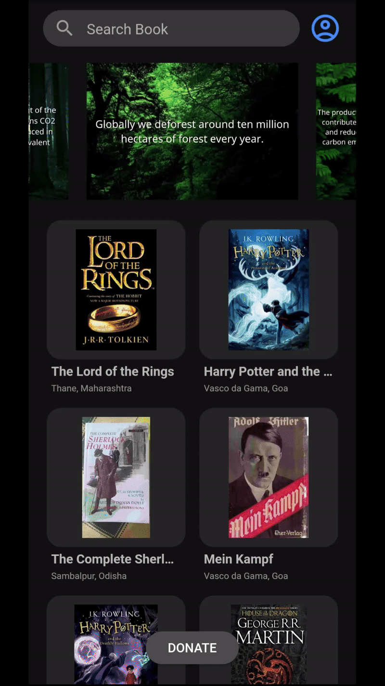

<br>
<div align="center">
    <a href="https://github.com/varun2430/book_bounty/commits/main/"></a>
    <a href="https://github.com/varun2430/book_bounty/issues"></a>
    <a href="https://github.com/varun2430/book_bounty/blob/main/LICENSE"></a>
    <a href="https://www.linkedin.com/in/varun-kadkade-7359aa214/"></a>
</div>
<br>

<br />
<div align="center">
  <a href="https://github.com/varun2430/book_bounty">
    
  </a>

  <h3 align="center">BookBounty</h3>

  <p align="center">
    A book donation app
    <br />
    <br />
    <a href="https://drive.google.com/file/d/1SaZst3lLql_r0gczWLM9m5zSBC8zOF65/view?usp=drive_link">View Demo</a>
    ·
    <a href="https://github.com/varun2430/book_bounty/issues/new?labels=bug">Report Bug</a>
    ·
    <a href="https://github.com/varun2430/book_bounty/issues/new?labels=enhancement">Request Feature</a>
  </p>
</div>

## About The Project

<div align="center">
    
</div>

Book Bounty is a user-friendly app that provides a platform for people to donate books, while also enabling those who are looking for books to request them. The app is a great way to foster a sense of community by bringing together individuals who share a passion for reading and who want to help others access the knowledge and enjoyment that books can provide.

### Built With

The following are the list of frameworks/libraries used in this project.

<div align="center">
    
    
</div>

## Getting Started

This is a guide on how to set up the project locally. Follow these steps to get a local copy up and running.

### Prerequisites

Ensure you have the following installed:

- [Android Studio](https://developer.android.com/studio)
- [Flutter SDK](https://flutter.dev/docs/get-started/install)

### Installation

Clone the repository:

```sh
git clone https://github.com/varun2430/book_bounty.git
```

Install dependencies:

```sh
cd book_bounty
flutter pub get
```

Run the app:

```sh
flutter run
```

## Contributing

If you have a suggestion that would make this better, please fork the repo and create a pull request. You can also simply open an issue with the tag "enhancement".
Don't forget to give the project a star! Thanks again!

1. Fork the Project
2. Create your Feature Branch (`git checkout -b feature/AmazingFeature`)
3. Commit your Changes (`git commit -m 'Add some AmazingFeature'`)
4. Push to the Branch (`git push origin feature/AmazingFeature`)
5. Open a Pull Request

## License

Distributed under the GPL-3.0 License. See `LICENSE` for more information.
